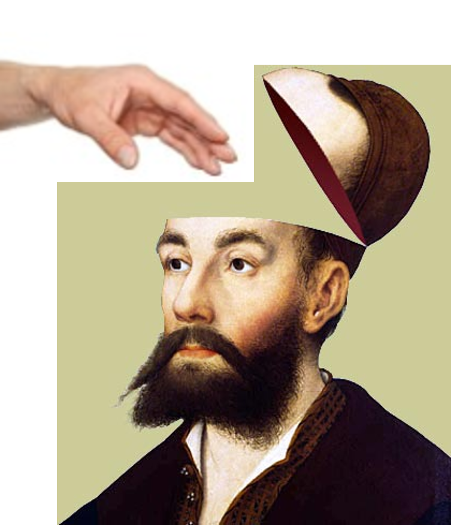
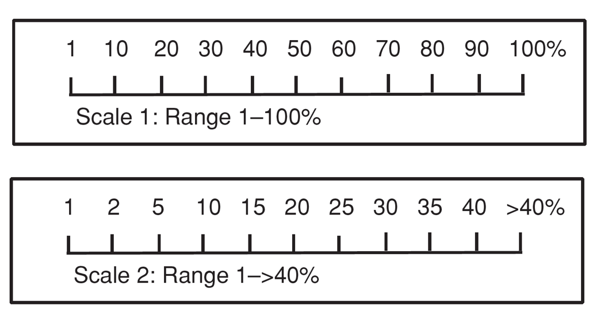
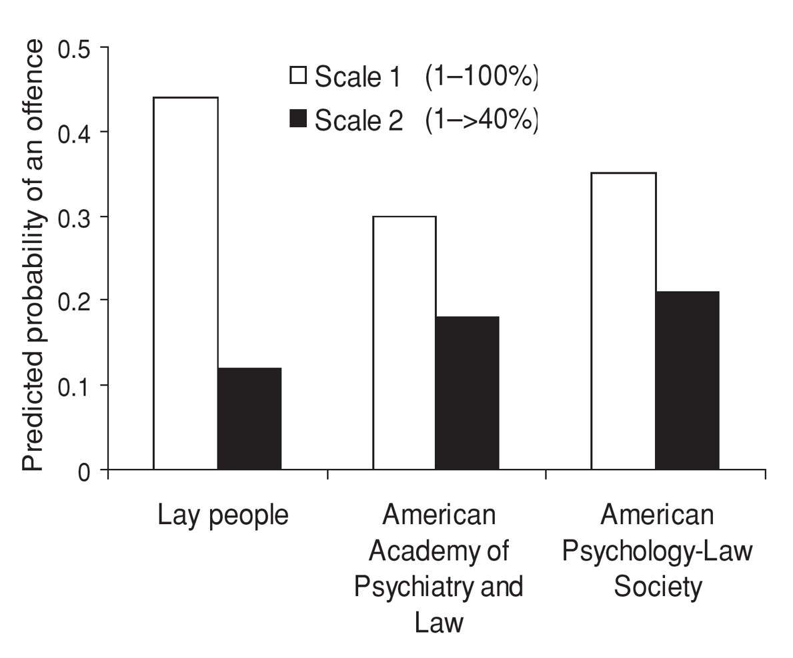
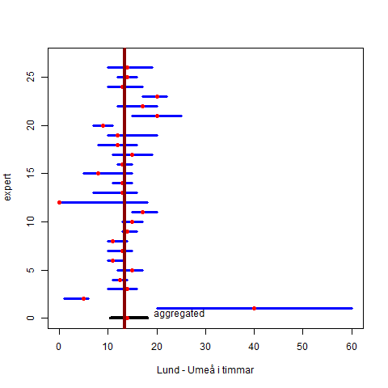
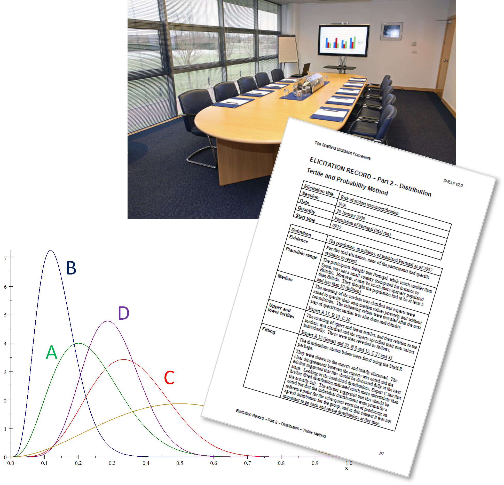
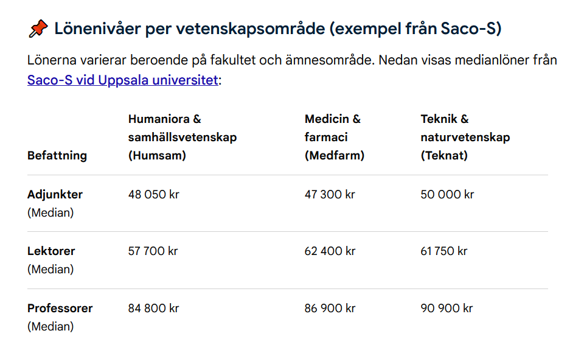

## Linguistic uncertainty

> There is life on Mars

> Impact on biodiversity is high

- Vagueness: natural and scientific language allows borderline cases e.g. the number of mature plants

- Ambiguity: some words have more than one meaning and it is not clear which meaning is intended e.g. cover

- Underspecificity: unwanted generality in data

## Linguistic uncertainty 

> The factory constitute a moderate risk

> There is a 30% probability of rain tomorrow

- Prominent in qualitative risk assessment due to the use of qualitative expressions

- Can be avoided by using well defined questions, quantities and outcomes and meaningful scales

## Subjective Risk Assessment

A tool from Mark and his colleagues to reduce linguistic uncertainty

[SRA tool manual](https://cebra.unimelb.edu.au/__data/assets/pdf_file/0007/2488507/SRA3-manual-sra_ver.3_manual.pdf)

## Subjective Risk Assessment

**Rain** - There will be rain tomorrow

**Space** - Aliens from space will arrive to the earth in our lifetime

**Trump** - Trump becomes the next president of USA

Use the AUSTRALIAN SCALES!

Make judgements with single scores e.g. 3 or ranges, e.g. 2-4

## Delphi process to aggregate judgements from a group of experts

- Make individual judgements

- Compare where there are large differences in judgements.

- Discuss and resolve the reason for differences. Here is where linguistic uncertainties can be reduced.

- Redo individual judgements

- Aggregate the judgements

## Expert Elicitation

::::: columns
::: column
Formal, structured approaches designed to

- retrieve judgements from a group of experts by a systematic, documented and reviewable process

- minimise cognitive biases
:::

::: column
{width="80%"}
:::
:::::

## Expert knowledge elicitation

- Framing

- Anchoring and Adjustment

- Heuristics Availability

- Motivational biases

- Numeracy

- Group thinking

- Range-Frequency

- Overconfidence

## Anchoring

## Anchoring

Two scales to collect judgements on the probability of an offence

## Wisdom of the crowd

Question to students in previous class:

**How long time does it take to drive from Lund to Umeå in hours?**

## Aggregating expert judgement {.smaller}

::::: columns
::: column
- Mathematical aggregation: with or without expert calibration

- Behavioural aggregation: facilitated interaction

- Delphi method: multiple rounds of individual judgements followed by summary of judgements after every round until convergence is obtained

- Combinations of these e.g. IDEA and the SAHLIN-protocol\*

\*in development
:::

::: column

:::
:::::

## What makes a good expert {.smaller}

- Not necessarily the most senior, high-powered or knowledgeable people

The ideal group of experts will

- have sufficient diversity of experience and opinion to achieve the desired coverage, and

- be willing to share their opinions and to listen to the opinions of others

::: notes
From the SHELF elicitation framework
:::

## What might *not* make a good expert {.smaller}

- An expert who is highly-respected but is arrogant and unwilling to acknowledge any contrary opinion

- A very senior person who has become a manager and lacks recent experience ‘at the coal-face’

- A junior person who is unwilling to contribute their views, or who will simply defer to more senior members of the group

- A representative of a stakeholder organisation who will always assert the organisation’s position

- An expert whose knowledge and opinions are expected to be very close to those of another expert in the group

## Sheffield elicitation framework {.smaller}

[shelf.sites.sheffield.ac.uk](https://shelf.sites.sheffield.ac.uk/home)

- Quartile method

- Probability method

- Roulette method

- Fitting distributions to judgements

- Consensus judgement (RIO)

## Question

::::: columns
::: column
1.  What is Ullrika's monthly salary right now?

Evidence dossier:

- Ullrika is Associate professor at the Faculty of Science at Lund university

- She is 50 years old

- She is a woman
:::

::: column

:::
:::::
