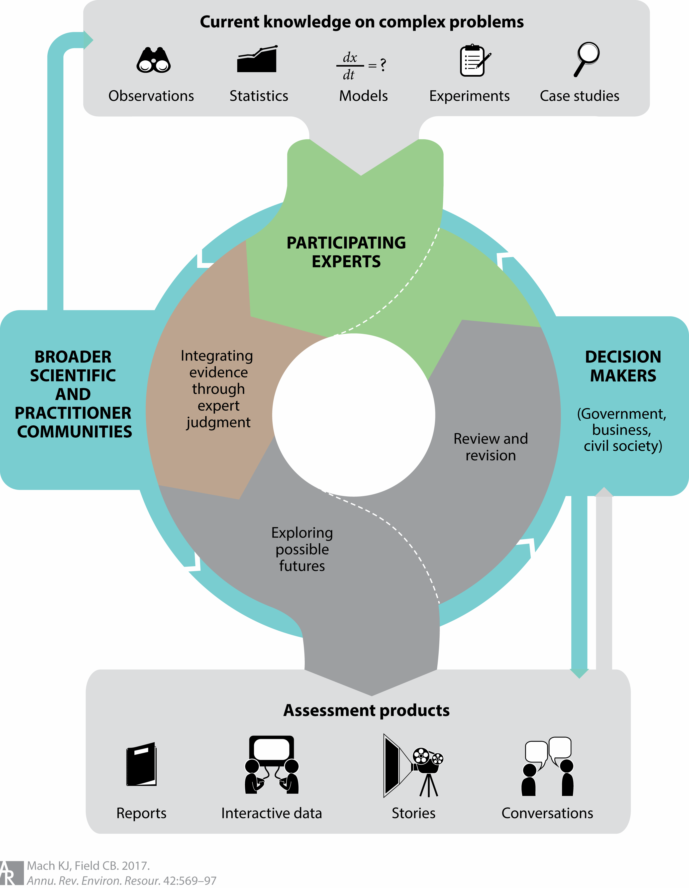
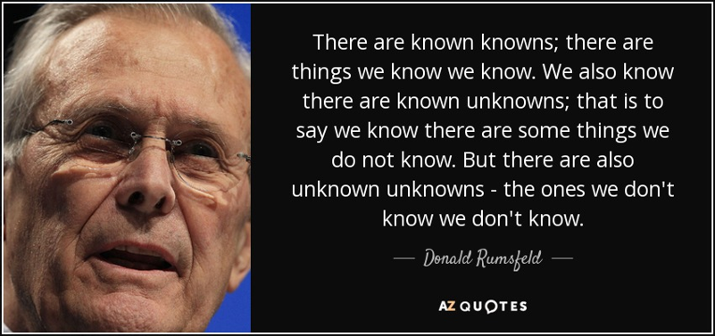
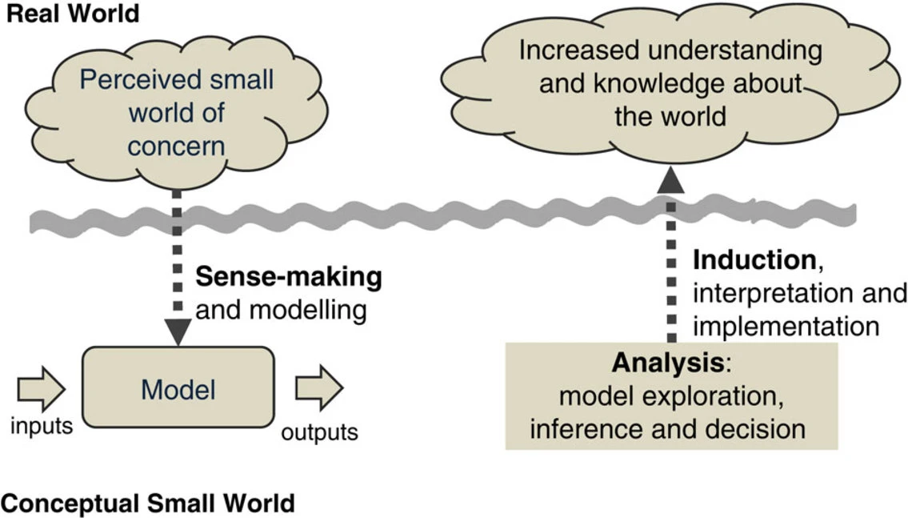
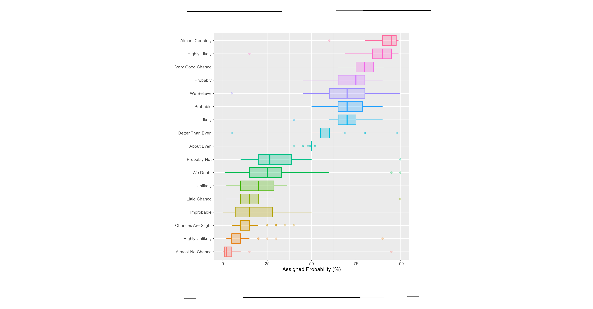
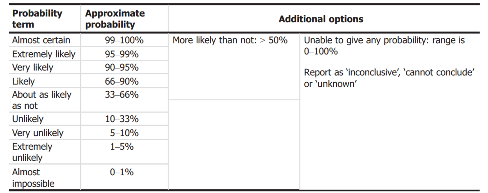
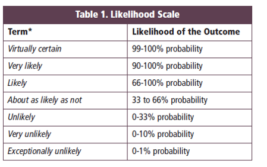
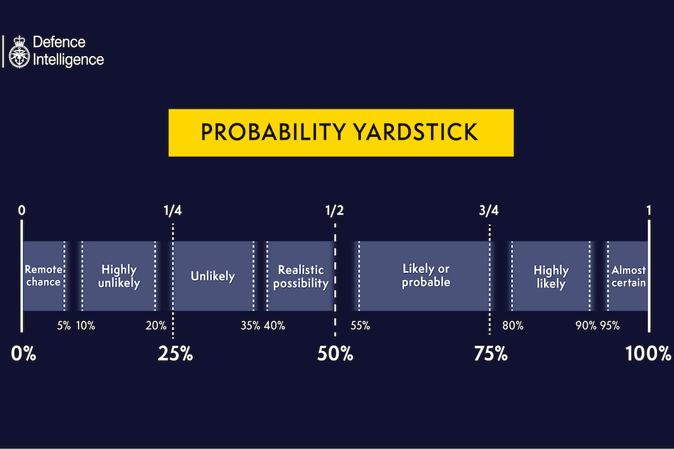

## Scientific assessments 

Scientific assessment is an integration of diverse evidence, applying rigorous expert judgment to evidence and its uncertainties, exploring futures and their connections to choices, and incorporating interactions among experts and decision makers in assessment processes.

## Scientific assessments

{width="90%"}

## Unknown unknowns

{width="80%"}

## Small world 

## Characterising uncertainty in a conclusion

For a well-defined question,

- Identify sources of uncertainty affecting the assessment

- Express quantitatively the overall impact of as many as possible of the identified uncertainties, and describing qualitatively any that remain unquantified

- If useful, break the assessment into parts

## Characterising uncertainty

<!--  -->

<!-- Qualitative expressions of uncertainty, such as likely or unlikely, are ambiguous and mean different things to different people. -->

EFSA recommends that assessors always try to express their uncertainty in a conclusion quantitatively using (subjective) probability.

- To the extent that is scientifically achievable

- Leaving unknown unknowns

The judgement on ”overall uncertainty” should consider the combined impact of all sources of uncertainty,

- which requires expert judgement.

## Whose probabilities? {.smaller}

Requirement for using probability to describe uncertainty:

- Ownership: The P should be one that the scientists are willing to claim as their own. 

- Justification: The scientists should be able to justify their choice of P. I would argue that a P is not adequately justified unless, in arriving at that P, scientists strive to take into account all of the available evidence regarding the predictive variable—this might include modeling results, background theory, and observational data—as well as what is known (or not known) about the limitations of those sources of evidence, their interdependencies, and so forth.

## Whose probabilities? {.smaller}

Requirement for using probability to describe uncertainty:

- Robustness: The P should be robust in each of two senses; 

- not be highly sensitive to contentious assumptions

- not be expected to change substantially without any drastic changes in the background knowledge 

## Verbal and quantitative expressions

## Probability scales

## Probability scales

{width="30%"}

## Probability scales

{width="50%"}