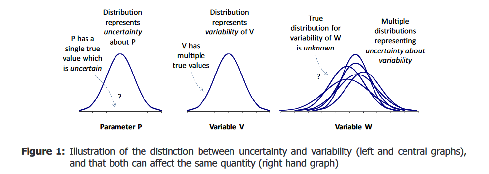

## Linquistic uncertainty

> Impact on biodiversity is high

> There is a 30% probability of rain tomorrow

- Prominent in qualitative risk assessment due to the use of qualitative expressions

- Can be avoided by using well defined questions, quantities and outcomes and meaningful scales

## Subjective Risk Assessment

A tool from Mark and his colleagues to reduce linguistic uncertainty

[SRA tool manual](https://cebra.unimelb.edu.au/__data/assets/pdf_file/0007/2488507/SRA3-manual-sra_ver.3_manual.pdf)

## Subjective Risk Assessment

Rain - Rain tomorrow

Rocket - Next moon rocket crash on earth

Trump - Trump becomes the next president of USA

Make judgements with single scores e.g. 3 or ranges, e.g. 2-4

## Delphi process to aggregate judgements from a group of experts

- Make individual judgements
- Compare where there are large differences in judgements. - Discuss and resolve the reason for differences. Here is where linguistic uncertainties can be reduced.
- Redo individual judgements
- Aggregate the judgements

## Interpretation of probability

[Tutorial on uncertainty where Ullrika explains probability distribution](https://multimedia.efsa.europa.eu/uncertainty-tutorial/uncertainty-communication/expressions-distribution.html)

> the frequency with which sampled values arise within a specified range or for a specified category

> a quantification of a judgement on the likelihood of a particular range or category

::: callout-note
The mathematical theory for probability is the same for both interpretations!
:::

## Probability distributions

[Visualising probability distributions](https://multimedia.efsa.europa.eu/uncertainty-tutorial/uncertainty-communication/expressions-distribution.html#communicating-uncertainty-about-a-quantity-of-interest-by-a-probability-distribution)

## Uncertainty and variability

